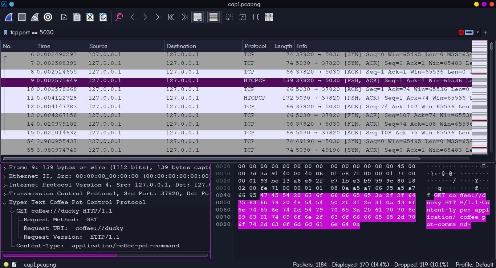
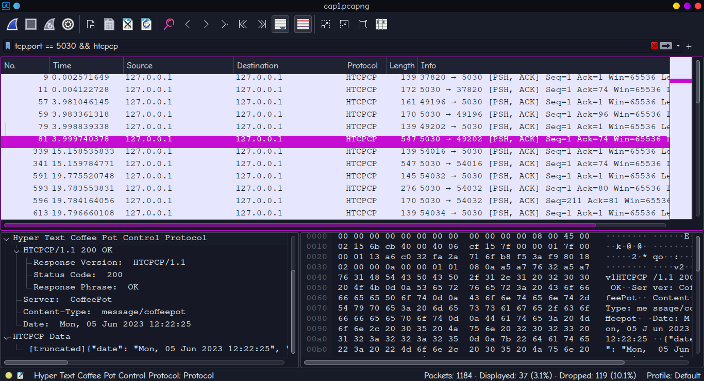

# `htcpcp_dissector`

A Wireshark dissector for HTCPCP.



## Description

In this lab, when filtering by `tcp.port==5030`, all TCP traffic will be labelled as TCP, including packets with [HTCPCP](https://www.rfc-editor.org/rfc/rfc2324) data since HTCPCP is built over TCP.
- We can't see the custom HTCPCP traffic, since Wireshark doesn't have a [dissector](https://wiki.wireshark.org/Lua/Dissectors) for it.

Installing this would label the relevant packets as HTCPCP, making your life easier when using Wireshark for this lab.
- **Note**: This disassembler does not account for [TCP packet reassembly](https://www.wireshark.org/docs/wsug_html_chunked/ChAdvReassemblySection.html) even though it is [recommended by the documentation](https://wiki.wireshark.org/Lua/Dissectors). I don't know enough about Lua to do that.

## Installation
1. Ensure the local plugins directory for Wireshark exists.
    - This would be `~/.local/lib/wireshark/plugins` in Linux systems, and in `~\AppData\Roaming\Wireshark\plugins` on Windows.
    - If you're using `cmd` (why?), `~` won't work. Replace it with `%USERPROFILE%` or just `C:\Users\[your username]`.


    Do **create** the directory if it's missing.

    ```bash
    mkdir -p [local plugin directory]
    ```
2. Copy `htcpcp.lua` to the plugins directory.
    ```bash
    cp ./dissector/htcpcp.lua [local plugin directory]
    ```
3. Re-open Wireshark, or reload the plugins with `CTRL-SHIFT-L`.


## Usage
As with any other protocol in Wireshark, you can filter by it with the tag `htcpcp`.

The plugin works for most HTCPCP traffic, including HTCPCP messages with data, though the data will be truncated if it's too large:    

